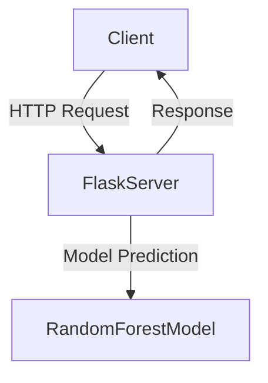
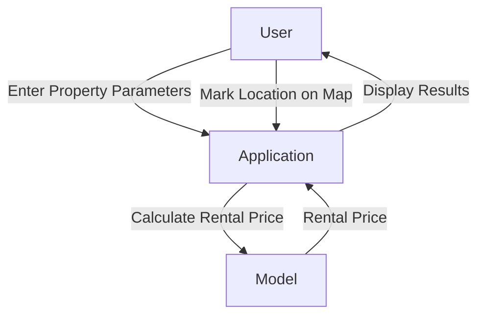
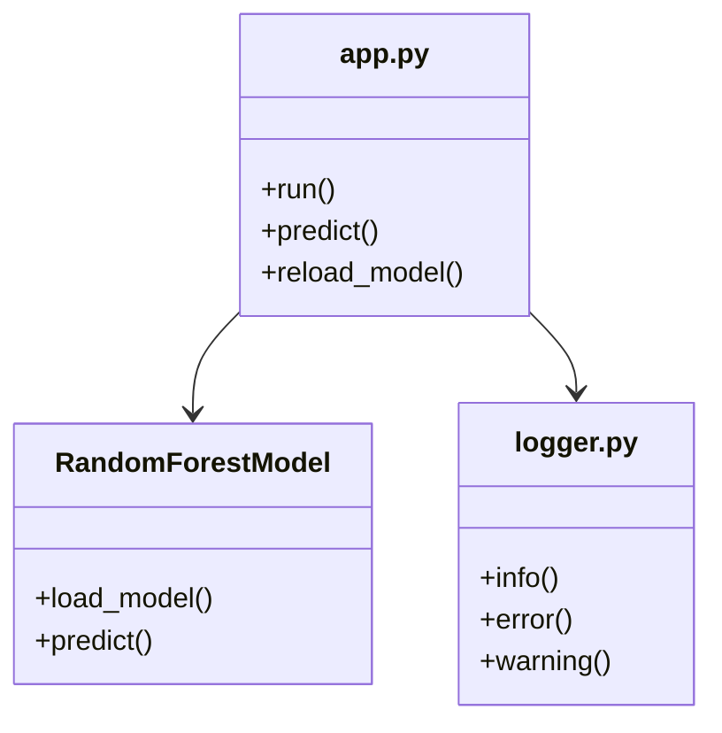
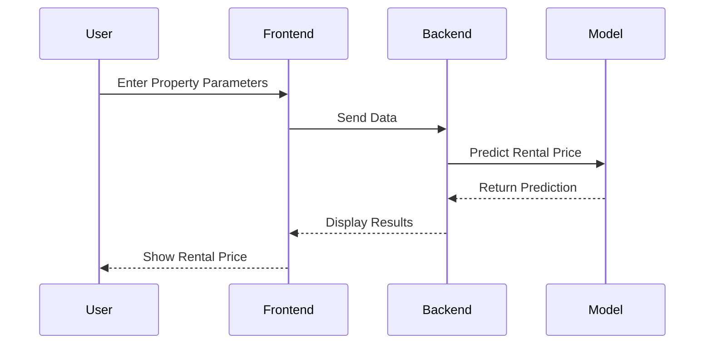

# Documentation - ByMetric.cz

## 1. Basic Information

- **Project Name:** ByMetric.cz – Intelligent Rental Price Estimation in the Czech Republic
- **Author:** Martin Hornch
- **Contact:** informuj.747@gmail.com
- **Date:** 02.04.2025
- **School:** Střední průmyslová škola elektrotechnická Ječná 30
- **Type:** School project
- **GitHub:** [GitHub repository](https://github.com/Martin-H0/2025_OmegaV2)

---

## 2. Architecture

### Overview
The application is divided into **frontend**, **backend**, and **data layer**:
- **Frontend:** Responsible for user interaction (HTML, CSS, JavaScript).
- **Backend:** Handles business logic and communication with the model (Flask).
- **Data Layer:** Contains the trained Random Forest model and processes data.

### Deployment Diagram


### Use Case Diagram


### Class Diagram


### Sequence Diagram


---

## 3. Application Usage

### How the application works:
1. **Enter property parameters:** The user fills out a form with property parameters (area, number of rooms, number of kitchens, new construction).
2. **Mark location on the map:** The user clicks on the map to mark the property location.
3. **Calculate rental price:** The backend processes the data and uses the Random Forest model to calculate the estimated rental price.
4. **Display results:** The user sees the estimated rental price and additional information about the location.

---

## 4. Installation and Running

### Method 1: Using `install.py`
*Windows users are recommended to use method 2.*

1. Ensure Python (version 3.8 or higher) is installed.
2. Run the following command:
    ```bash
    python install.py
    ```
3. After installation, run the application:
    ```bash
    python run.py
    ```
4. Open a browser and go to [http://127.0.0.1:5000](http://127.0.0.1:5000).
    - Address and port can be changed in `config.py`.

### Method 2: Using `run.bat` (for Windows)
1. Double-click the `run.bat` file.
2. The script will:
    - Check if Python is installed (and install it if necessary).
    - Run `install.py` to create a virtual environment and install dependencies.
    - Activate the virtual environment.
    - Run `run.py` to start the application.
3. Open a browser and go to [http://127.0.0.1:5000](http://127.0.0.1:5000).
    - Address and port can be changed in `config.py`.

---

## 5. Error Handling

### Possible Errors:
- **Model not loaded:**
    - **Error:** Model is not loaded. Check configuration.
    - **Solution:** Ensure the model file exists at the correct path.
- **Error detecting region:**
    - **Error:** Error detecting region: ...
    - **Solution:** Check the availability of the OpenStreetMap API.
- **404 Page:**
    - **Error:** Page not found.
    - **Solution:** The user is redirected to the 404 page.
- **500 Page:**
    - **Error:** Internal Server Error.
    - **Solution:** The user is redirected to the 500 page.

---

## 6. Libraries

### Third-party libraries:
- Flask: Web framework.
- Pandas: Data manipulation.
- Scikit-learn: Machine learning (Random Forest).
- Requests: HTTP requests.
- Leaflet.js: Interactive maps.
- Bootstrap: Responsive design.

---

## 7. Data Acquisition

The data was obtained from the following sources:
1. **Sreality.cz:** The data was scraped from the Sreality.cz website.
2. **Data Cleaning:** Several steps of data cleaning were performed to ensure its quality.
3. **Additional Information:** Additional information was supplemented using OpenStreetMap.org (e.g., distance from the city center, district code).
4. **Apartment Label Decomposition:** Apartment labels (e.g., 4+kk, 2+kk, 2+1) were broken down into:
    - Number of rooms
    - Separate kitchen (1/0)
    - Bonus parameters

After these steps, the data was prepared for training the Random Forest model.

---

## 8. Sources

The ByMetric.cz project was created based on the following sources:
- **Author:** Martin Hornch
- **Previous Projects:** Project Alpha and other works.
- **Consultations and Testing:** Adam Hlaváčik, Ondřej Kábrt, Pavel Hornych, Tomáš Križko.
- **AI:** [t3.chat](https://t3.chat/)
- **Internet:** 
    - [w3schools](https://www.w3schools.com/)
    - [canva](https://www.canva.com/)
    - [flaticon](https://www.flaticon.com/)
    - [GitHub](https://www.github.com)

---

## 9. Conclusion

The **ByMetric.cz** project is a web application for estimating rental prices in the Czech Republic. The application uses artificial intelligence (Random Forest) to calculate the estimated price based on property parameters and location. The project is fully responsive, includes navigation, error pages, and favicon support.

### Key Features:
- Rental price estimation.
- Responsive design.
- Interactive map.
- Support for error handling.

